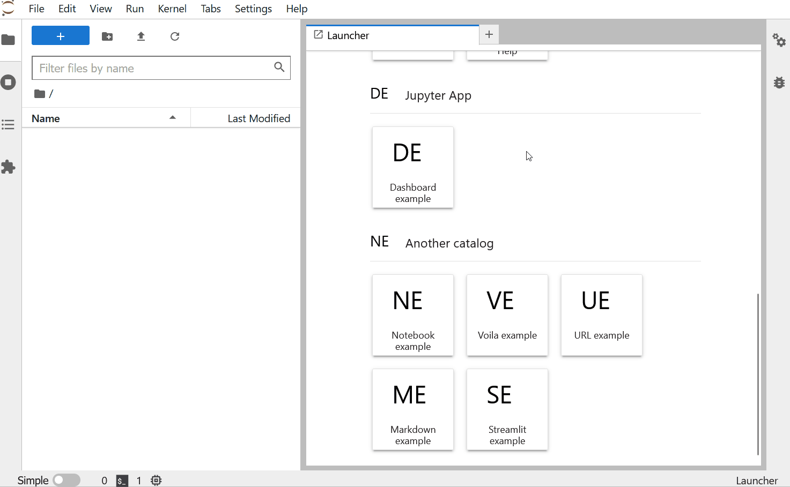
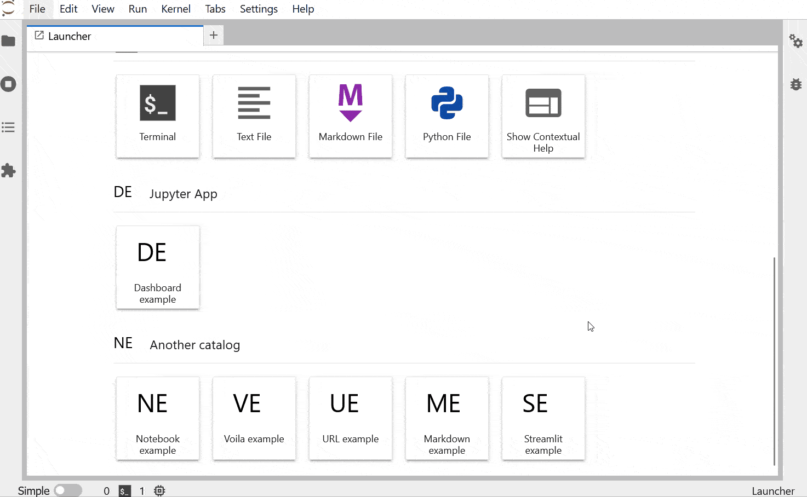
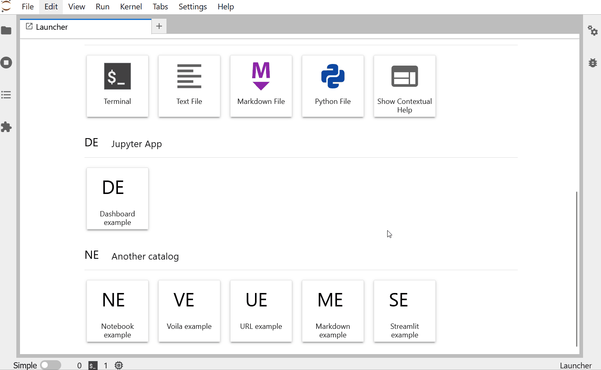

<h1 align="center">jupyter_app_launcher</h1>

[](https://github.com/trungleduc/jupyter_app_launcher/actions/workflows/build.yml) [](https://jupyter-app-launcher.readthedocs.io/en/latest/?badge=latest) [](https://mybinder.org/v2/gh/trungleduc/jupyter_app_launcher/main?urlpath=lab) [](https://trungleduc.github.io/jupyter_app_launcher/lab/index.html) [](https://github.com/trungleduc/jupyter_app_launcher/blob/master/LICENSE)

<h2 align="center"> A JupyterLab extension to create custom launcher entries </h2>

**jupyter_app_launcher** helps users customize the JupyterLab launcher with a simple YAML file. Users can add custom entries to the launcher to:

- Open a predefined notebook or markdown file.
- Render a notebook in dashboard mode
- Open a notebook with Voila
- Start a local web server and open the predefined URL.
- Open a remote URL.

https://user-images.githubusercontent.com/4451292/191499842-3b3aae7b-dd61-416b-9958-6490c1e220c7.mp4

## Try it online!

You can try it online by clicking on this badge:

[](https://mybinder.org/v2/gh/trungleduc/jupyter_app_launcher/main?urlpath=lab)

Or you can run it directly in your browser with `JupyterLite`:

[](https://trungleduc.github.io/jupyter_app_launcher/lab/index.html)

## Documentation

You can read the documentation following this link: https://jupyter-app-launcher.readthedocs.io/

## Installation

You can install using `pip`:

```bash
pip install jupyter-app-launcher
```

Or using `conda`:

```bash
conda install -c conda-forge  jupyter_app_launcher
```

**jupyter_app_launcher** works with **JupyterLab**>=3.1

## Example

### Open a predefined notebook



### Open a predefined markdown file


### Render a notebook in dashboard mode


### Open a notebook with Voila



### Start a local web server and open the URL.



### Open a remote URL


## Contributing

See [Contributing](https://jupyter-app-launcher.readthedocs.io/en/latest/develop-install.html)

## Packaging the extension

See [RELEASE](RELEASE.md)
