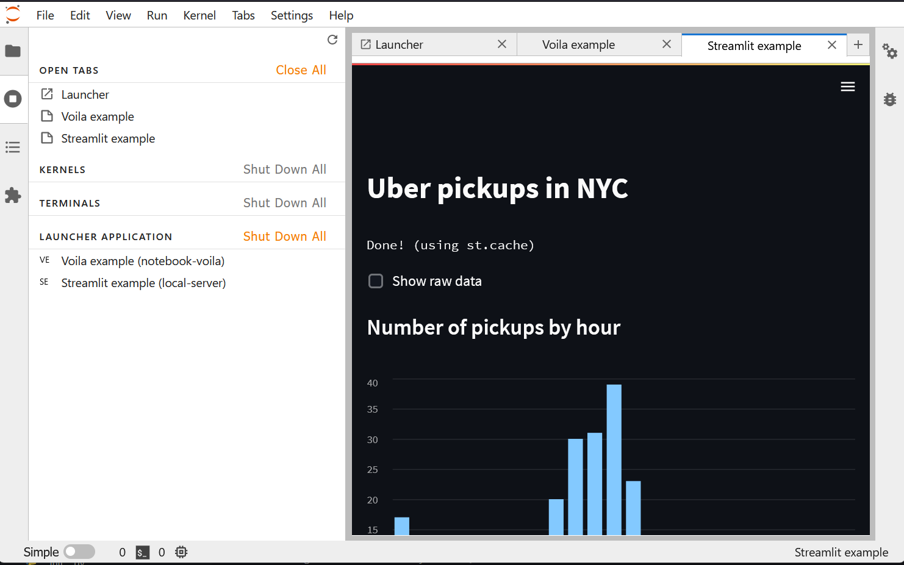

=============
Usage
=============

*jupyter_app_launcher* relies on *YAML* files to create and add entries to the launcher. Depending on the type of entry, different parameters are required.

Configuration file location
==========================================

By default, *jupyter_app_launcher* will look for `jupyter_app_launcher` directory in the list of data directories of *Jupyter* (i.e. the data section of the ``jupyter --path`` command), for example:

.. code-block:: shell

  > jupyter --path

  config:
      /home/***/mambaforge/envs/appdev/etc/jupyter
      /home/***/.jupyter
      /home/***/.local/etc/jupyter
      /usr/local/etc/jupyter
      /etc/jupyter
  data: # -> Here are the paths used by jupyter_app_launcher
      /home/***/mambaforge/envs/appdev/share/jupyter
      /home/***/.local/share/jupyter
      /usr/local/share/jupyter
      /usr/share/jupyter
  runtime:
      /home/***/.local/share/jupyter/runtime

If under the `jupyter_app_launcher` directory of these paths, YAML files (`.yaml`, `.yml`) with name starting with `jp_app_launcher` exist, they will be used. For example, the following files will be loaded:

.. code-block:: shell

  /home/***/mambaforge/envs/appdev/share/jupyter/jupyter_app_launcher/jp_app_launcher.yaml
  /home/***/mambaforge/envs/appdev/share/jupyter/jupyter_app_launcher/jp_app_launcher_my_app.yml
  /home/***/.local/share/jupyter/jupyter_app_launcher/jp_app_launcher_my_other_app.yml

In addition to this behavior, `jupyter_app_launcher` also loads the YAML files with names starting with `jp_app_launcher` in the directory where JupyterLab was started, and also in the path defined by the ``JUPYTER_APP_LAUNCHER_PATH`` environment variable.

.. note::
  This extension only reads the configuration file when JupyterLab starts. Users need to restart JupyterLab after changing the config file.

Configuration file content
==========================================

The YAML file should contain an array of objects, *jupyter_app_launcher* will create the corresponding launcher entry for each object. Here is an example of the configuration file:

.. code-block:: yaml

    - title: Dashboard example
      description: Example of opening a notebook in dashboard mode without Voila
      source: ../../samples/sample.ipynb
      cwd: ../../samples
      type: notebook-grid

    - title: Notebook example
      description: Example of opening a notebook in dashboard mode without Voila
      source: ../../samples/sample.ipynb
      cwd: ../../samples
      type: notebook
      catalog: Another catalog

    - title: Voila example
      description: Example of opening a notebook in dashboard mode with Voila
      source: ../../samples/sample.ipynb
      cwd: ../../samples
      type: notebook-voila
      args:
          theme: dark
      catalog: Another catalog

    - title: URL example
      description: Example of opening a URL in a tab
      source: https://jupyterlab.readthedocs.io/en/stable/
      type: url
      catalog: Another catalog
      args:
          sandbox: [ 'allow-same-origin', 'allow-scripts', 'allow-downloads', 'allow-modals', 'allow-popups']

    - title: URL example (new window)
      description: Example of opening a URL in a new browser window
      source: https://jupyterlab.readthedocs.io/en/stable/
      type: url
      catalog: Another catalog
      args:
          createNewWindow: true

    - title: Streamlit example
      description: Example of opening a streamlit app
      source: http://localhost:$PORT/
      cwd: ./
      type: local-server
      args:
        - streamlit
        - run
        - st_app.py
        - --server.headless=true
        - --server.port=$PORT
      catalog: Another catalog

    - title: Command example
      description: Example of calling JupyterLab commands
      type: jupyterlab-commands
      source:
        - label: Command 1
          id: 'filebrowser:open-path'
          args:
            path: sample.ipynb
        - label: Command 2
          id: 'filebrowser:open-path'
          args:
            path: sample-2.ipynb
      catalog: Another catalog

The common fields of the configurations are: ``title``, ``description``  ``icon`` and ``catalog``.

- ``title``: Title of the launcher entry.
- ``description`` (Optional): Description of the launcher entry. It will be shown on mouse hover.
- ``icon`` (Optional): Path to the icon of the launcher entry. If it is not defined, the initials of the title will be used as the icon.
- ``catalog`` (Optional): Catalog of the launcher entry, entry with the same catalog will be grouped in the same group in the launcher, If it is not defined, `Jupyter App` catalog will be used.

Other fields will have different meanings depending on the entry type. In this section, we will detail these fields for each type of entry.

----------------------------------------------
Open a predefined notebook
----------------------------------------------
This launcher entry will create a new notebook in the current working directory of *JupyterLab* with predefined content.

.. code-block:: yaml

    - title: Notebook example
      description: Example of opening a notebook in dashboard mode without Voila
      source: ../../samples/sample.ipynb
      cwd: ../../samples
      type: notebook
      catalog: Notebook catalog

- ``type`` = ``notebook``
- ``source``: Path to the notebook (can be stored anywhere) which will be copied to the current working directory of *JupyterLab*. It can be an absolute path or a relative path to the directory of the configuration file.
- ``cwd``: Unused.

.. figure:: images/notebook.gif

   Notebook demo.

--------------------------------------
Open a predefined markdown file
--------------------------------------
This launcher entry will render the content of a predefined markdown file.

.. code-block:: yaml

    - title: Markdown example
      description: Example of opening a Markdown file in a tab
      source: ../../samples/sample.md
      type: markdown
      catalog: Another catalog

- ``type`` = ``markdown``
- ``source``: Path to the markdown file. It can be an absolute path or a relative path to the directory of the configuration file.
- ``cwd``: Unused.

.. figure:: images/markdown.gif

   Markdown demo.

----------------------------------------------
Render a notebook in gridstack dashboard mode
----------------------------------------------
This launcher entry will open a predefined notebook in the gridstack dashboard view. Users need to use the `jupyterlab-gridstack` extension to edit the layout of the dashboard and save the dashboard metadata. The launcher entry will read the metadata and then render the notebook with the saved layout.

.. code-block:: yaml

    - title: Dashboard example
      description: Example of opening a notebook in dashboard mode without Voila
      source: ../../samples/sample.ipynb
      cwd: ../../samples
      type: notebook-grid

- ``type`` = ``notebook-grid``
- ``source``: Path to the notebook file. It can be stored anywhere on your system and can be an absolute path or a relative path to the directory of the configuration file.
- ``cwd``: The working directory where the notebook will be started. it's important to set this field correctly if you need to load local files with relative paths in your notebook.

.. figure:: images/notebook-grid.gif

   Notebook dashboard demo.

.. note::
  - This dashboard mode does not depend on `Voila`. It's a frontend-only approach and is a lightweight solution for dashboarding notebooks.
  - Users can also open a notebook in this dashboard mode by right clicking on the notebook and select `Open With -> Notebook GridStack` in the context menu.

--------------------------------------
Open a notebook with Voila
--------------------------------------
This launcher entry also renders the predefined notebook in dashboard mode but unlike ``notebook-grid``, this mode uses `Voila` and users have access to all configurations of  `Voila`, for example, the template or themes.

.. code-block:: yaml

    - title: Voila example
      description: Example of opening a notebook in dashboard mode with Voila
      source: ../../samples/sample.ipynb
      cwd: ../../samples
      type: notebook-voila
      args:
          theme: dark
          template: gridstack

      catalog: Another catalog

- ``type`` = ``notebook-voila``
- ``source``: Path to the notebook file. It can be stored anywhere on your system and can be an absolute path or a relative path to the directory of the configuration file.
- ``cwd``: Unused, `Voila` will be started in the same directory of the source notebook.
- ``args``: The arguments list that will be passed to the `Voila` startup command. For example, in the code block above, ``--theme=dark`` and ``--template=gridstack`` will be passed to the `Voila` command.

.. figure:: images/voila.gif

   Voila demo.

---------------------------------------------------
Start a local process and open the predefined URL.
---------------------------------------------------
This launcher entry will start a process with predefined commands and open a local URL in a new panel of JupyterLab.

.. code-block:: yaml

  - title: Streamlit example
    description: Example of opening a streamlit app
    source: http://localhost:$PORT/
    cwd: ./
    type: local-server
    args:
      - streamlit
      - run
      - st_app.py
      - --server.headless=true
      - --server.port=$PORT
    catalog: Another catalog

- ``type`` = ``local-server``
- ``args``: The command which will be executed inside a sub-process, defined as a list of arguments. For the web server applications that need to define the listening port, users can use the `PORT` variable.
- ``source``: The URL which will be opened after executing the command. *jupyter_app_launcher* will poll for the availability of the URL for 120 seconds. Environment variables inside URL will be substituted with the value of the variable.
- ``cwd``: Current working directory of the subprocess.

.. figure:: images/local-url.gif

   Local server demo.

.. note::
 *jupyter_app_launcher* uses the *jupyter-server-proxy* extension to expose the local URL, so using this entry type behind a reserve proxy server is straightforward.

--------------------------------------
Open a remote URL.
--------------------------------------

This launcher entry will open the predefined URL in a new panel of JupyterLab by using an IFrame element.

.. code-block:: yaml

    - title: URL example
      description: Example of opening a URL in a tab
      source: https://jupyterlab.readthedocs.io/en/stable/
      type: url
      catalog: Another catalog
      args:
          sandbox: [ 'allow-same-origin', 'allow-scripts', 'allow-downloads', 'allow-modals', 'allow-popups']
          referrerPolicy: ['no-referrer']
          createNewWindow: false

- ``type`` = ``url``
- ``source``: The URL which will be opened by this entry.
- ``args`` (Optional): The sandbox and referrer policy setting of the IFrame. Alternatively, set ``createNewWindow`` to ``true`` to open the URL in a new browser window.
- ``cwd``: Unused.

.. figure:: images/url.gif

   URL demo.

--------------------------------------
Run JupyterLab commands.
--------------------------------------

This launcher entry will run predefined JupyterLab commands.

.. code-block:: yaml

    - title: Command example 2
      description: Example of calling JupyterLab commands
      type: jupyterlab-commands
      source:
        - label: Command 1
          id: 'filebrowser:open-path'
          args:
            path: sample.ipynb
        - label: Command 2
          id: 'another-jupyterlab-command-id'
          args: my-args
      catalog: Config 2

- ``type`` = ``jupyterlab-commands``
- ``source``: The list of JupyterLab commands to be called. Each command is defined by 3 property:

  - ``label``: The user-defined label of the command.
  - ``id``: The id of the JupyterLab command.
  - ``args``: The arguments to be passed "as-is" to the command.

- ``args``: Unused.
- ``cwd``: Unused.

The execution of commands will be stopped if a command fails, and the error message will be shown in a dialog.

Running subprocesses manager
======================================================

In the case of ``notebook-voila`` or ``local-server`` launcher entry, *jupyter_app_launcher* will start the corresponding process in a subprocess. Users can keep track and shut down running subprocesses by using the **Launcher Application** section in the running panel of *JupyterLab*

   Running subprocess

Using *jupyter_app_launcher* with *JupyterLite*
======================================================

*jupyter_app_launcher* is compatible with *JupyterLite*, but due to the limit of the lite kernel, the entry types using `subprocess` do not work in *JupyterLite*.
The available entry types in *JupyterLite* are: ``notebook``, ``notebook-grid``, ``markdown``, and ``url``. To use *jupyter_app_launcher*, users need to add the extension and the configuration file to the deployment.

- To add *jupyter_app_launcher* extension to a *JupyterLite* website, users can refer to the official documentation here_.

- To add the configuration to *JupyterLite*, *jupyter_app_launcher* provides the command `app_launcher` to do the process:

    jupyter app_launcher build <path-containing-the-YAML-file> <path-to-the -JupyterLite-directory>

The above command will read the ``config.yaml`` file in the first path argument and put it in the `overrides.json` file (the command will create it if needed) of the *JupyterLite* deployment in the second path argument. Users need to rebuild the deployment to take the changes.

Using *jupyter_app_launcher* on *myBinder*
==========================================

Users can refer to the example on `project repository <https://github.com/trungleduc/jupyter_app_launcher/tree/main/binder>`_ for deploying *jupyter_app_launcher* on *myBinder*.

.. links

.. _`ipywidgets`: https://github.com/jupyter-widgets/ipywidgets/

.. _here: https://jupyterlite.readthedocs.io/en/latest/howto/configure/simple_extensions.html#add-additional-extensions-to-a-jupyterlite-website
